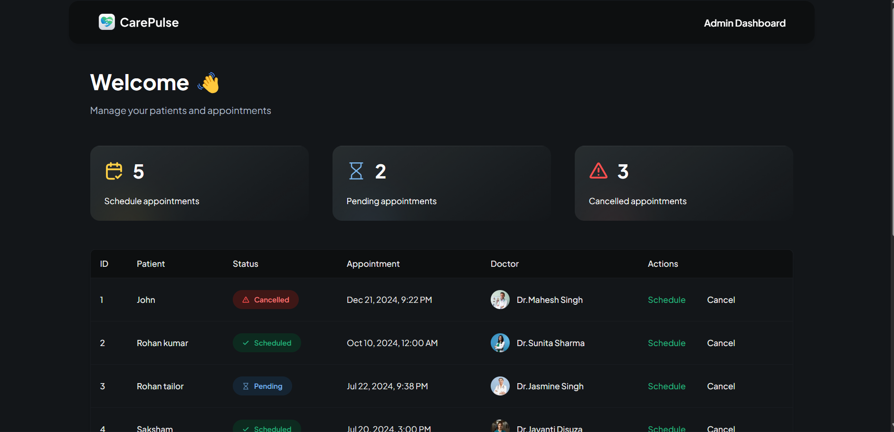
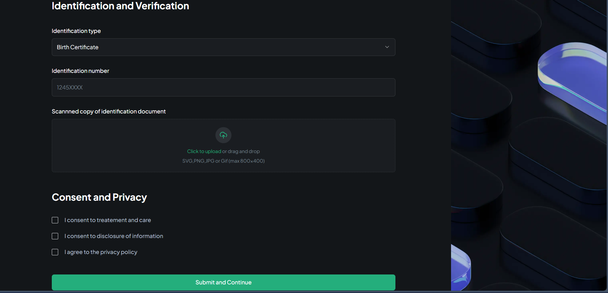
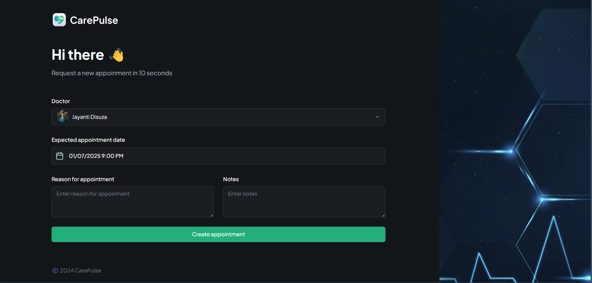

# Care Pulse

A healthcare application enabling users to schedule appointments and receive notifications, enhancing healthcare accessibility.

---

## Features

### Appointment Scheduling
- Easy booking of healthcare appointments.
- SMS notifications for appointment reminders via **Twilio**.

### Complex Form Handling
- Dynamic and user-friendly forms for capturing patient and appointment details.
- Validation and error handling for seamless user experience.

### Admin Panel
- Passkey validation for Admin Portal.
- Administrative dashboard for managing appointments, users, and notifications.
- Role-based access control for secure operations.

### SMS Integration
- Automated SMS reminders for scheduled appointments.
- Integration with **Twilio** for reliable message delivery.

### Appwrite Integration
- Backend-as-a-service for managing user authentication and database operations.
- Streamlined APIs for faster development.

---

## Technologies Used

### Backend
- **Next.js**: Framework for React applications.
- **Appwrite**: Backend services for authentication and data handling.
- **Twilio**: SMS notification integration.

### Frontend
- **Next.js** and **TypeScript**: UI development.
- **Tailwind Css**: Component library for styling.

---

## Prerequisites

- Node and npm installed on your system.
- Appwrite backend setup and Twilio account for SMS integration.

---

## Setup Instructions

### 1. Clone the Repository
```bash
git clone <repository-url>
cd <repository-directory>
```

### 2. Backend Setup
Navigate to the backend directory:

```bash
cd backend
```

Install dependencies:

```bash
npm install
```

Create a .env file in the backend directory and add the following:

```env
PORT=5000
APPWRITE_PROJECT_ID=<your-appwrite-project-id>
TWILIO_ACCOUNT_SID=<your-twilio-sid>
TWILIO_AUTH_TOKEN=<your-twilio-auth-token>
TWILIO_PHONE_NUMBER=<your-twilio-phone-number>
```

Start the backend server:

```bash
npm start
```

### 3. Frontend Setup
Navigate to the frontend directory:

```bash
cd frontend
```

Install dependencies:

```bash
npm install
```

Start the Next.js development server:

```bash
npm run dev
```

---

## Screenshots

1. **Login Page**

   

2. **Admin Panel**

   

3. **Form Handling**

   

4. **Appointment Page**

   
.png)
